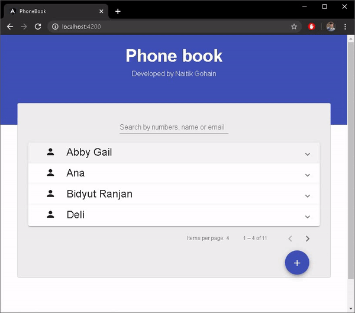

# Phone book

Phone book is a web app developed with Node.js and Angular which allows user to manage their contacts.



## Requirements
All the nodejs and angularjs libraries are inside package.json. A simple ```npm install``` will install the packages.

Database used is Postgres, the backup file of the database is provided with the name ```phonebook_db.backup```. Restore the database in Postgres as database name ```phonebook```.

Node server runs on port 3000.

Angular runs on 4200


## Features

* View all the contacts with pagination and maximum of 4 results per page
* Single page application (SPA) based on Angular 8
* Add contact with multiple phone nos and email ids
* Edit contact
* Delete contact
* Search contact by name, phonenumber, and email address


## Development server

Run `ng serve` for a dev server. Navigate to `http://localhost:4200/`. The app will automatically reload if you change any of the source files.

## Code scaffolding

Run `ng generate component component-name` to generate a new component. You can also use `ng generate directive|pipe|service|class|guard|interface|enum|module`.

## Build

Run `ng build` to build the project. The build artifacts will be stored in the `dist/` directory. Use the `--prod` flag for a production build.

## Running unit tests

Run `ng test` to execute the unit tests via [Karma](https://karma-runner.github.io).

## Running end-to-end tests

Run `ng e2e` to execute the end-to-end tests via [Protractor](http://www.protractortest.org/).

## Further help

To get more help on the Angular CLI use `ng help` or go check out the [Angular CLI README](https://github.com/angular/angular-cli/blob/master/README.md).


## License
[MIT](https://choosealicense.com/licenses/mit/)
